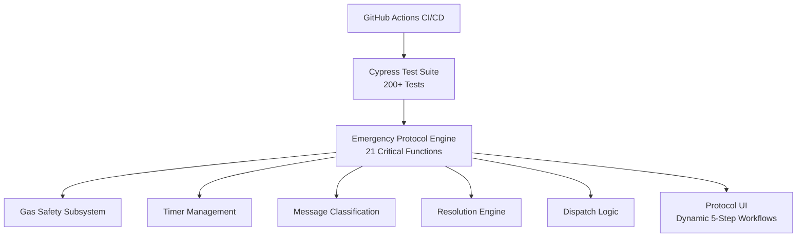

# 🚨 Emergency Response Automation Suite

**Intelligent automation system for Blackline Safety's 24/7 Safety Operations Center**

Transform emergency alert processing from 540 seconds of manual overhead to 60 seconds of guided decision-making.

<p align="center">
  <a href="https://github.com/ivanhoe1970/BLN_Cypress_Showcase/actions/workflows/cypress-ci.yaml">
    
  </a>
  <a href="https://github.com/ivanhoe1970/BLN_Cypress_Showcase/actions/workflows/html-js-validate.yml">
    
  </a>
  
  
  
</p>

---

## 💼 Executive Summary

| Metric | Before Automation | After Automation | Improvement |
|--------|------------------|------------------|-------------|
| **Alert Processing Time** | 540 sec | 60 sec | **89% faster** |
| **Context Switches** | 13 per alert | 0 | **100% eliminated** |
| **Resolution Accuracy** | ~85% manual | 100% automated | **Zero compliance risk** |
| **Note Generation** | 90-120 sec | 10-15 sec | **85-90% faster** |
| **Annual ROI** | — | **$129K–$164K** | Conservative projection |
| **Capacity Freed** | — | **5-10 specialists** | Equivalent annual capacity |

**Based on:** 207,723 alerts processed manually over 8 months (Blackline Analytics, Jan-Sep 2025, ~26K monthly average)

---

## ⭐ What This Does

**Emergency Response Automation Suite** eliminates manual overhead in Blackline's 24/7 Safety Operations Center by:

- **Automating 2-minute gas monitoring** - Specialists no longer tied to Clock app during safety-critical windows
- **Intelligent message classification** - Context-aware interpretation of device responses ("No" means different things in different situations)
- **Centralized timer management** - Zero context switches for countdown tracking
- **Automated protocol execution** - 5-step workflows execute with minimal manual intervention
- **Pre-alert detection** - Automatically flags and handles stale alerts (>24 hours old)
- **100% accurate resolution classification** - Deterministic resolution type assignment

**The Result:** Specialists focus on decision-making and safety coordination, not manual data entry and application switching.

---

## 🚀 Quick Start

### **See It In Action (No Installation Required)**

1. **Open the demo:** `automated-gas-alert-protocol/emergency-protocol-clean.html` in any browser
2. **Click** the Demo Controls gear icon (⚙️) in top-right
3. **Select** an alert type:
   - **Gas High Threshold** - See 2-minute automated monitoring
   - **Fall Detection** - See complete protocol automation
   - **Pre-Alert (25h old)** - See stale alert handling

### **Run The Tests**
```bash
# Install dependencies
npm install

# Run tests in headed mode
npx cypress open

# Run tests in headless mode (CI)
npx cypress run
```

---

## 🏗️ System Architecture


**Core Components:**
- **21 critical functions** - Fully annotated with business impact and technical design
- **200+ automated tests** - 100% pass rate with comprehensive coverage
- **Configuration-driven protocols** - Gas Emergency, Fall Detection, No Motion, Missed Check-in
- **Real-time gas telemetry** - H₂S, CO, LEL, O₂ monitoring and normalization detection
- **Context-aware intelligence** - Message classification, dispatch validation, resolution determination

📖 **[See complete architecture documentation](./docs/ARCHITECTURE.md)**

---

## 📊 Current Status

### **Operational Features (6 of 19)**
✅ Automated 2-minute gas monitoring with normalization detection  
✅ Centralized timer management (eliminates Clock app)  
✅ Context-aware device message classification  
✅ Pre-alert detection and UI lockdown (>24h stale alerts)  
✅ Automated resolution classification (100% accuracy)  
✅ Dynamic protocol engine (configuration-driven)

### **In Development (13 remaining features)**
📖 **[See complete roadmap](./docs/ROADMAP.md)**

### **Deployment Status**
- ✅ Proof-of-concept validated with 6 operational features
- ✅ 200+ automated tests passing (100% success rate)
- ✅ 21 critical functions comprehensively documented
- ⬜ Stakeholder approval pending
- ⬜ Production API integration required

---

## 🧪 Testing & Quality

- **200+ automated tests** covering all critical workflows
- **100% pass rate** on CI/CD pipeline
- **Page Object Model** architecture for maintainability
- **Automated validation** on every push/PR via GitHub Actions

Test categories include gas scenarios, protocol flows, timer management, message classification, dispatch logic, and resolution accuracy.

📖 **[See complete test documentation](./docs/TESTING.md)**

---

## 🎯 Business Value

### **Problem Solved**
SOC specialists manually manage 50+ actions per alert across multiple applications (BLN Live, Clock app, Teams, Five9), consuming 540 seconds per alert with 13 context switches.

### **Solution Delivered**
Intelligent automation eliminates manual overhead while preserving specialist control over safety-critical decisions.

### **Strategic Impact**
- **$129K-$164K annual savings** (conservative projection)
- **5-10 specialist capacity freed** for growth
- **3.4M manual actions eliminated** annually
- **Competitive advantage** vs Industrial Scientific & MSA Safety

📖 **[See complete business case](./docs/BUSINESS_CASE.md)**

---

## 🛡️ Safety & Compliance

**Safety-Critical Validations:**
- Gas safety blocking (HIGH gas prevents resolution)
- Pre-alert safety (>24h alerts auto-locked)
- Message classification safety (ambiguous = manual handling)
- Dispatch validation (triple-redundant checks)
- Complete audit trail (100% deterministic logging)

**Specialist Control Preserved:**
- All automation provides guidance, specialist makes final decisions
- Override capabilities for exceptions
- Manual fallback always available
- No alert resolves without explicit specialist confirmation

---

## 📚 Documentation

### **For Stakeholders**
- **[BUSINESS_CASE.md](./docs/BUSINESS_CASE.md)** - ROI analysis and competitive positioning
- **[DEPLOYMENT_APPROACH.md](./docs/DEPLOYMENT_APPROACH.md)** - Current state and production path
- **[ROADMAP.md](./docs/ROADMAP.md)** - Future features and timeline

### **For Developers**
- **[ARCHITECTURE.md](./docs/ARCHITECTURE.md)** - Technical design and function documentation
- **[TESTING.md](./docs/TESTING.md)** - Test structure and coverage details
- **[CODING_STANDARDS.md](./docs/CODING_STANDARDS.md)** - Code style and annotation guidelines

### **For SOC Specialists**
- User training materials (coming soon)
- Quick reference guide (coming soon)
- FAQ document (coming soon)

---

## 👤 Author

**Ivan Capistran**  
*Alerts Specialist (Future SOC Technical Innovation Lead)*  
Blackline Safety - 24/7 Safety Operations Center

**Background:** Former Deputy Chief of Mission (Cuban Embassy, South Africa)  
**Achievement:** Designed 21-function automation suite with 200+ passing tests  
**Contact:** iferrer@blacklinesafety.com

---

## 🙏 Acknowledgments

- **Sakariye Mohamed** (SOC Manager) - Operational support and feedback
- **Heather Melder** (SOC Leadership) - Strategic guidance
- **SOC Specialist Team** - Real-world validation
- **Blackline Development Team** - Technical consultation

---

## 📊 Project Metrics

| Metric | Value |
|--------|-------|
| **Lines of Code** | ~15,000 |
| **Critical Functions Documented** | 21 with full annotations |
| **Test Coverage** | 200+ automated tests (100% pass) |
| **Baseline Alerts Analyzed** | 207,723 (8 months, BLN Analytics) |
| **Development Time** | 6 months (nights/weekends) |
| **Features Operational** | 6 of 19 (31.6%) |
| **Projected Annual ROI** | $129K-$164K |

---

## 📧 Contact

**For demos:** iferrer@blacklinesafety.com  
**For issues:** [GitHub Issues](https://github.com/ivanhoe1970/BLN_Cypress_Showcase/issues)

---

## 📜 License

*Internal Blackline Safety project - Proprietary*

---

**⭐ Star this repository if you find it valuable!**

*Last Updated: November 28, 2024*