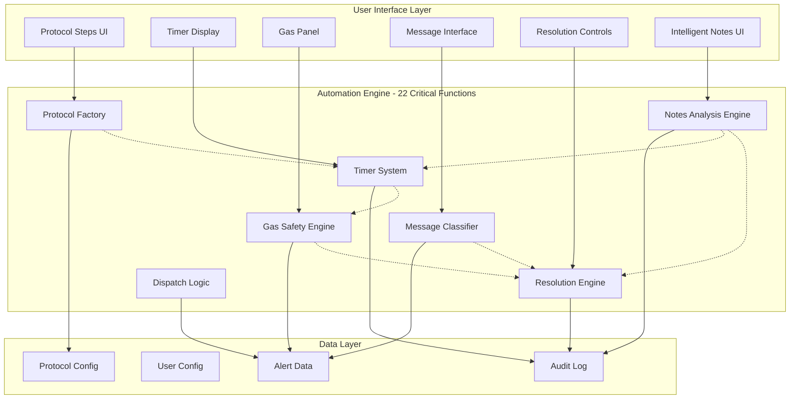

# Emergency Response Automation Suite

Technical Architecture and Prototype Overview

This repository contains the complete technical architecture, prototype implementation, and and testing framework for the Emergency Response Automation Suite. The system replicates and automates the core steps of Blackline Safety’s emergency alert workflows for both gas and non-gas alerts, including device messaging, real-time gas safety gating, dispatch logic, intelligent coordination, and protocol resolution.

The prototype is fully client-side, configuration-driven, and aligned with all BLN safety requirements. It demonstrates how automation reduces manual actions, eliminates coordination bottlenecks, and improves response consistency across the SOC.

---

## Table of Contents

1. System Overview
2. High-Level Architecture
3. Core Architecture Components
4. Protocol Factory
5. Timer Management System
6. Gas Safety Subsystem
7. Message Classification Engine
8. Intelligent Notes Analysis Engine
9. Resolution Engine
10. The 22 Critical Functions
11. Design Principles
12. Integration Points
13. Performance Characteristics
14. Future Architecture Enhancements
15. Additional Resources

---

## System Overview

### Architecture Philosophy

The Emergency Response Automation Suite follows a configuration-driven, modular design based on the following principles:

- Protocols are data, not hardcoded logic
- Automation guides workflow but never bypasses safety-critical decision points
- Gas safety rules enforce conservative thresholds
- Single global timer prevents confusion and eliminates Clock app dependency
- Intelligent coordination eliminates manual Teams messaging
- New protocols can be added through configuration only

### Scope

The prototype simulates the complete alert lifecycle:

- Step-based protocol execution
- Timer-driven escalation
- Gas monitoring and safety gating
- Device message classification
- Cross-specialist coordination automation
- Dispatch logic validation
- Resolution enforcement
- Full restart handling
- Pre-alert detection (greater than 24 hours)

---

## High-Level Architecture



---

# Core Architecture Components

## 1. Protocol Factory (Configuration Engine)

**Purpose:**  
Transforms JSON configurations into runnable protocol workflows.

**Rationale:**  
Protocols must be customer-specific and dynamic. Hardcoded logic would block scalability and increase engineering cost.

**Pattern:**  
Static registry and factory method.

**Benefits:**

- Unlimited protocol variations
- Enables the Protocol Configuration Manager (PCM)
- Configuration-only deployments

---

## 2. Timer Management System

**Purpose:**  
Eliminates Clock app usage and prevents multi-timer confusion.

**Key Features:**

- Single global timer
- Visual countdown with audio alerts
- Context-aware cancellation
- Full audit logging
- Supports monitoring, callback, and dispatch timers

**State Model:**

```json
{
  "stepId": "step-2",
  "label": "Gas Monitoring",
  "duration": 120,
  "startTime": "Date.now()",
  "timerType": "monitoring",
  "isRunning": true
}
```

---

## 3. Gas Safety Subsystem

**Purpose:**  
Automates gas monitoring and enforces safety rules.

**Capabilities:**

- Real-time gas telemetry panel
- 2-minute automated monitoring window
- Auto-resolution on normalization
- HIGH gas blocks resolution unless override provided
- O₂ depleted/enriched detection included

**Normalization Logic:**

```
H2S === NORMAL &&
CO === NORMAL &&
LEL === NORMAL &&
O2 === NORMAL
```

---

## 4. Message Classification Engine

**Purpose:**  
Interprets device messages using context.

**Key Concept:**  
Meaning of "Yes" or "No" depends on the prompt sent.

**Example Table:**

| Message   | Context           | Meaning             |
| --------- | ----------------- | ------------------- |
| No        | Do you need help? | Safe                |
| No        | Leave the area?   | Refusing evacuation |
| Send help | Any               | SOS                 |

**Stateful Classifier:**

- Tracks last prompt
- Handles ambiguous replies
- Supports 2-minute timeout window

---

## 5. Intelligent Notes Analysis Engine

**Purpose:**  
Automatically eliminates cross-specialist coordination delays.

**Based on:**  
Pattern recognition, confidence scoring, safety validation.

**Actions:**

- Cancel timers across all specialists
- Suggest resolution
- Trigger escalation
- Synchronize alert state across sessions

**Impact:**

- Coordination time reduced by 75–85%
- Zero missed synchronization events
- Removes reliance on Teams messages

---

## 6. Resolution Engine

**Purpose:**  
Determines the correct resolution type using deterministic rules.

**Resolution Types:**

- incident-with-dispatch
- incident-without-dispatch
- false-alert-with-dispatch
- false-alert-without-dispatch
- pre-alert

**Safety Gates:**

- HIGH gas blocks resolution unless override
- Dispatch state tracked explicitly
- Pre-alert (>24h) disables protocol steps

---

# The 22 Critical Functions

**Categories:**

- Core Protocol Functions
- Gas Safety Functions
- Timer Functions
- Automation Functions
- Intelligence Functions
- Resolution Functions
- Pre-Alert Functions

_(See ARCHITECTURE.md for full definitions.)_

---

# Design Principles

- Configuration over code
- Fail-safe defaults
- Idempotent operations
- Single source of truth
- Progressive disclosure
- Conservative safety thresholds
- Full auditability
- Intelligent automation

---

# Integration Points

**Current Prototype:**

- All data in fixtures
- Fully client-side
- No backend or API calls

**Production Requirements:**

- BLN Live Alert API
- BLN Live Resolution API
- Audit Log API
- Device Messaging API
- WebSocket gas telemetry

The automation system requires no new backend APIs.

---

# Performance Characteristics

**Client-Side Performance:**

- Protocol loading: <50ms
- Step execution: <10ms
- Gas panel updates: <100ms
- Pattern recognition: <100ms
- Coordination updates: <200ms
- Memory footprint: <2MB

**Scalability:**

- Unlimited protocols
- Unlimited alert types
- Single global timer by design

---

# Future Architecture Enhancements

## 1. Protocol Configuration Manager (PCM)

**Vision:**  
Provide a configuration-driven method for designing, validating, and deploying customer-specific emergency response protocols without requiring Blackline engineering to modify code.

**Architecture:**  
Form-based Web UI → Customer profile & device capabilities → Step Builder → Validation Engine → JSON protocol definition → Deployment into Protocol Engine

**Key Responsibilities:**

- Device-aware step filtering (G7c vs G7x)
- Emergency contact hierarchy with priority and advanced contact rules
- Time-based and location-based routing
- Gas threshold and safety rule configuration
- Industry-specific message templates and multi-language support
- Validation engine (loop detection, capability enforcement, required fields)
- JSON export/import for integration with the automated platform

**Benefit:**  
Reduces engineering workload, accelerates customer onboarding, prevents configuration errors, and enables scalable customer-specific deployments.

---

## 2. Enhanced Alerts Page (Real-Time Visual Acknowledgment Status)

**Vision:**  
Introduce a real-time, color-coded urgency and acknowledgment system in the Alerts Portal.

**Architecture:**  
Alert creation timestamp → elapsed timer → visual state engine → dynamic UI updates

**Color Model:**

- Blue (0–30 seconds): Calm
- Yellow (31–50 seconds): Caution
- Red (51+ seconds): SLA breach
- Green (Acknowledged): Operator ID visible
- Neutral (Resolved): Closed/filterable

**Benefit:**  
Eliminates manual Teams-based coordination and improves situational awareness.

---

## 3. Intelligent Alert Assignment System

**Vision:**  
Eliminate the first-click race and route each alert to the optimal specialist.

**Architecture:**  
Alert feed → Assignment Engine → Eligibility filter → Fairness calculation → Assignment → WebSocket broadcast

**Supporting Components:**

- Identity Gate
- Break/availability sync
- Shift Lead Dashboard
- Full audit trail

**Benefit:**  
Assigns alerts within one second, reduces response delays, and ensures fairness.

---

# Additional Resources

ARCHITECTURE.md  
PCM Technical Specification  
Real-Time Visual Alert Status  
Alert Auto-Assignment System  
TESTING.md  
ROADMAP.md  
DEPLOYMENT_APPROACH.md  
ROI_Analysis.pdf

**Document Version:** 2.0  
**Last Updated:** November 29, 2025  
**Author:** Ivan Ferrer – Alerts Specialist (SOC Technical Innovation Lead)
