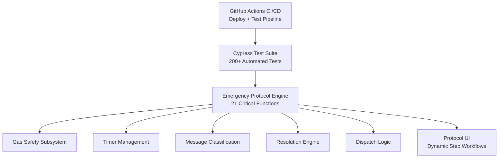

System Architecture

Emergency Response Automation Suite – Technical Design Documentation

This document provides a complete technical overview of the Emergency Response Automation Suite, describing the architecture, design rationale, and implementation of the 21 safety-critical automation functions powering the system.

Table of Contents

System Overview

Architecture Diagram

Core Architecture Components

Protocol Factory

Timer Management System

Gas Safety Subsystem

Message Classification Engine

Resolution Engine

Error Handling Architecture

Security Considerations

Client–Server Boundaries

Integration Points

21 Critical Functions

Design Principles

Performance Characteristics

Future Enhancements

1. System Overview

The Emergency Response Automation Suite is a modular, configuration-driven platform designed to:

Separate protocol definition from execution

Remove repetitive manual tasks for specialists

Maintain human authority on all safety-critical decisions

Fail safely under every condition

Scale horizontally by adding new protocols without touching engine code

Improve audit reliability and operational consistency

The system simulates Blackline Live alert workflows end-to-end: timers, dispatch logic, resolution gating, gas monitoring, device messaging, message classification, and full protocol restart cycles.

2. Architecture Diagram

This simplified Mermaid diagram is the official architecture view.
It is guaranteed to render on GitHub and is identical in style to the working README diagram.

3. Core Architecture Components

The system is composed of three primary layers.

UI Layer

Renders everything visible to the specialist:

Dynamic protocol steps

Gas telemetry

Connectivity status

Device message interface

Timer display

Resolution workflow

Automation Engine (21 Critical Functions)

Executes all protocol logic:

Protocol selection

Step sequencing

Timer control

Gas safety gating

Dispatch validation

Resolution enforcement

Intelligent message classification

Automatic log generation

Data Layer

Stores and manages:

Alert metadata

Protocol configuration objects

User configuration

Audit logs

(Future) API integration boundaries with Blackline Live

4. Protocol Factory

Purpose: Build and load protocol steps dynamically.
Design: Protocols are data, not code.

Example:

{
  "name": "Gas Emergency Protocol",
  "steps": [
    { "id": "step-1", "action": "call-device" },
    { "id": "step-2", "action": "message-device", "timer": 120 },
    { "id": "step-3", "action": "call-user" },
    { "id": "step-4", "action": "contact-ecs" },
    { "id": "step-5", "action": "dispatch" }
  ]
}

Benefits

Customer-specific protocols

Zero code changes for new workflows

Enables the Protocol Configuration Manager (PCM)

5. Timer Management System

A single global timer ensures deterministic behavior.

Key Features

Exclusive timer execution

Visual countdown

Audio alerts

Timer metadata (source, duration, type, stepId)

Automatic timer cancellation

Prevention of overlapping or “ghost” timers

6. Gas Safety Subsystem

Responsible for:

Live gas telemetry (H₂S, CO, LEL, O₂)

HIGH vs NORMAL classification

O₂ depletion / enrichment rules

2-minute gas monitoring windows

Automatic normalization detection

Resolution gating (HIGH blocks resolution)

Override workflows with required reasoning

Gas Classification Logic
If O₂ < 19.5% or > 23.5% → Dangerous  
If H₂S > 10ppm or CO > 35ppm or LEL > 10% → HIGH  
Else → NORMAL  

Fail-safe default:
Missing gas data → treated as HIGH

7. Message Classification Engine

Context-aware interpretation of device replies.

Prompt Sent	Reply	Meaning	Action
Do you need help?	No	OK	Resolve
Are you OK?	Yes	OK	Resolve
Any	Send help	Emergency	Dispatch
Any	Unknown	Ambiguous	Manual step

Classification uses contextual state, not keyword matching.

8. Resolution Engine

Uses a deterministic set of rules:

If gas HIGH → block resolution  
If dispatch occurred → incident-with-dispatch  
Else → incident-without-dispatch  

Additional logic:

Pre-alert (≥24 hours old) auto-selects resolution

HIGH gas requires override with explicit reason

All resolutions logged with timestamp + operator

9. Error Handling Architecture

The system uses multi-layer defensive error handling:

UI Layer Errors

Disabled buttons prevent unsafe actions

Warnings on missing or invalid data

State Machine Guards

Steps cannot execute out of order

Steps cannot run twice

Illegal transitions are blocked

Timer Safety

Single active timer

Clean cancellation behavior

Automatic cleanup on expiration

Gas Safety Defaults

Missing gas data → HIGH

Normalization requires ALL readings NORMAL

Message Classification Errors

Unknown or garbled messages → no automation

Resolution Errors

Blocks resolution while gas HIGH

Blocks invalid or incomplete workflow states

10. Security Considerations
Prototype Security

Fully client-side

No external API calls

No stored credentials

No backend dependencies

Sanitized input handling

Logic separated from rendering

CSP-friendly architecture

Future Production Security

Requires:

OAuth2 / JWT authentication

Signed audit logs

Encrypted dispatch and resolution endpoints

WebSocket/SSE telemetry channels

Server-side validation / rate limiting

Secure message transmission channels

11. Client–Server Boundaries
Current

Everything client-side

Fixtures simulate API responses

No network dependencies

Future

Alert data loaded via API

Real-time gas via WebSocket

Dispatch/logging transmitted to BLN Live

CI/CD deployment to GitHub Pages remains unchanged

12. Integration Points

Future endpoints (modeled in fixtures):

GET /api/alerts/{id}
POST /api/alerts/{id}/resolve
POST /api/alerts/{id}/logs
POST /api/devices/{id}/message

13. The 21 Critical Functions
Core Protocol Functions

ProtocolFactory

loadProtocolSteps

loadAlert

startStep

restartProtocolCycle

Gas Safety Functions

startTwoMinuteMonitoring

updateGasReadings

triggerGasNormalization

isGasCurrentlyNormalized

Timer Functions

startGlobalTimer

cancelGlobalTimer

handleGlobalTimerCancellation

Automation Functions

postNote

autoPopulateFromDropdown

addLogEntry

Intelligence Functions

classifyIncomingMessage

handleMessageClassification

evaluateDispatchConditionsFromConnectivity

Resolution Functions

resolveAlert

determineResolutionType

Pre-Alert Functions

21a. isPreAlert
21b. addPreAlertLogEntry
21c. setupPreAlertResolution

14. Design Principles

Configuration over code

Fail-safe defaults

Idempotency

Single source of truth

Progressive UI disclosure

Conservative thresholds

Full auditability

15. Performance Characteristics

Protocol load < 50ms

Step execution < 10ms

Real-time gas rendering < 100ms

Timer updates every 1 second

Memory footprint < 1 MB

Zero timer leaks (fully managed cleanup)

16. Future Enhancements

Protocol Configuration Manager

Enhanced Alerts Page (priority triage + live gas)

Intelligent Alert Assignment System

API-integrated resolution & dispatch

WebSocket live telemetry

Persistent audit logging

Document Version: 3.1
Last Updated: November 28, 2025
Author: Ivan Ferrer (Op 417)