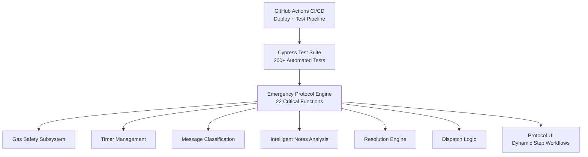

# 🏗️ System Architecture

**Emergency Response Automation Suite - Technical Design Documentation**

This document provides a complete technical overview of the Emergency Response Automation Suite, including the architecture, core subsystems, safety logic, and the 22 critical functions that power protocol execution, gas safety, timers, device communication, intelligent coordination, and resolution workflows.

---

## 📋 Table of Contents

- [System Overview](#system-overview)
- [Architecture Diagram](#architecture-diagram)
- [Core Architecture Components](#core-architecture-components)
- [Protocol Factory](#protocol-factory)
- [Timer Management System](#timer-management-system)
- [Gas Safety Subsystem](#gas-safety-subsystem)
- [Message Classification Engine](#message-classification-engine)
- [Intelligent Notes Analysis Engine](#intelligent-notes-analysis-engine)
- [Resolution Engine](#resolution-engine)
- [Error Handling Architecture](#error-handling-architecture)
- [Security Considerations](#security-considerations)
- [Client-Server Boundaries](#client-server-boundaries)
- [Integration Points](#integration-points)
- [The 22 Critical Functions](#the-22-critical-functions)
- [Design Principles](#design-principles)
- [Performance Characteristics](#performance-characteristics)
- [Future Enhancements](#future-enhancements)

---

## 🎯 System Overview

The Emergency Response Automation Suite uses a **modular, configuration-driven architecture** designed to:

- **Decouple protocol definition from execution**
- **Eliminate repetitive manual tasks** in Blackline Live workflows
- **Preserve specialist control** for all safety-critical decisions
- **Fail safely** under uncertainty
- **Scale horizontally** using configuration-only protocols
- **Improve auditability** through deterministic logs and timestamps

### **Simulation Scope**

The system simulates the full Blackline Live alert lifecycle, including:

- Protocol step sequencing
- Timer-driven escalation
- Gas monitoring and normalization detection
- Device messaging and response classification
- Intelligent specialist coordination
- Dispatch decision validation
- Safety-gated resolution logic
- Full protocol restart cycles

---

## 🏛️ Architecture Diagram


---

## 🧩 Core Architecture Components

The system consists of three major layers, each with clear responsibilities.

### **UI Layer**

Handles all direct user interaction:

- Dynamic 5-step protocol workflows
- Gas telemetry panel (H₂S, CO, LEL, O₂)
- Device connectivity panel
- Device messaging interface
- Timer display with countdown
- Intelligent notes analysis interface
- Resolution controls and override workflow

### **Automation Engine**

Implements the 22 critical functions:

- Protocol loading and execution
- Timer management and expiration routing
- Gas safety validation and normalization detection
- Context-aware message classification
- Intelligent notes pattern recognition
- Cross-specialist coordination automation
- Dispatch evaluation
- Resolution enforcement
- Deterministic audit log generation

### **Data & Integration Layer**

**Current State:**
- Alert metadata (client-side fixtures)
- Protocol configuration objects
- User configuration
- Audit log entries

**Future Integration:**
- BLN Live API
- WebSocket telemetry streams
- Backend resolution persistence

---

## 🏭 Protocol Factory

The Protocol Factory dynamically loads and constructs protocol flows based on alert type.

### **Purpose**

- Provide configuration-driven workflow definitions
- Remove all hardcoded step sequences
- Enable customer-specific variations
- Allow new protocols without touching engine code

### **Example Protocol Object**
```javascript
{
  "name": "Gas Emergency Protocol",
  "steps": [
    { "id": "step-1", "action": "call-device" },
    { "id": "step-2", "action": "message-device", "timer": 120 },
    { "id": "step-3", "action": "call-user" },
    { "id": "step-4", "action": "contact-ecs" },
    { "id": "step-5", "action": "dispatch" }
  ]
}
```

### **Benefits**

- Full configurability without code changes
- Immediate support for new alert types
- Enables advanced configuration tooling (Protocol Configuration Manager)
- Customer-specific protocol deployments

---

## ⏱️ Timer Management System

A single global timer ensures predictable, safe, and conflict-free time-driven behavior.

### **Core Features**

- Centralized timer state (prevents conflicts)
- 1-second countdown updates
- Visual + audio expiration alerts
- Clean cancellation logic
- Prevention of overlapping timers

### **Timer Metadata Example**
```javascript
{
  "stepId": "step-2",
  "label": "Gas Monitoring",
  "duration": 120,
  "startTime": 1732819200000,
  "timerType": "monitoring",
  "isRunning": true
}
```

### **Safety Features**

- Only one active timer at any time
- Automatic cleanup on cancellation
- Expiration routing based on timer type
- All timer events logged to audit trail

---

## ☣️ Gas Safety Subsystem

The gas engine enforces all safety-critical constraints before allowing workflow progression.

### **Responsibilities**

- Real-time rendering of H₂S, CO, LEL, O₂ levels
- HIGH vs NORMAL classification
- O₂ depletion/enrichment detection
- Automatic 2-minute monitoring windows
- Normalization detection with auto-resolution
- Resolution blocking while gas HIGH
- Override workflow requiring explicit justification

### **Gas Classification Rules**
```
If O₂ < 19.5% or > 23.5% → DANGEROUS (depleted/enriched)
If H₂S > 10 ppm → HIGH
If CO > 35 ppm → HIGH
If LEL > 10% → HIGH
Otherwise → NORMAL

Fail-safe default: Missing gas data → HIGH
```

### **Safety Logic**

- **Normalization requires ALL gases NORMAL** (fail-safe AND logic)
- **HIGH gas blocks resolution** unless overridden
- **Override requires supervisor reason** (dropdown selection)
- **All gas readings timestamped** and logged

---

## 💬 Message Classification Engine

The message classifier interprets device replies based on **prompt context**, not keyword matching.

### **Context-Aware Classification**

| Prompt Sent | Reply | Meaning | Action |
|-------------|-------|---------|--------|
| "Do you need help?" | "No" | User is OK | Resolve |
| "Are you OK?" | "Yes" | User OK | Resolve |
| Any | "Send help" | Emergency | Dispatch |
| Any | Unknown/Garbled | Ambiguous | Manual handling |

### **State Tracking**

The classification engine is **stateful**, tracking:
- Last prompt sent to device
- Timestamp of prompt
- Awaiting response flag
- 2-minute message timeout

### **Safety Feature**

Unknown, garbled, or ambiguous messages → **Manual specialist handling only** (no automated actions)

---

## 🧠 Intelligent Notes Analysis Engine

The Intelligent Notes Analysis Engine provides **real-time pattern recognition and cross-specialist coordination** to eliminate manual coordination bottlenecks during multi-specialist scenarios.

### **Cross-Specialist Coordination Challenge**

The most common SOC workflow inefficiency occurs when Specialist A sets a 30-minute EC callback timer, but the device user calls directly and confirms safety with Specialist B. Current workflow requires 7 manual coordination steps via Teams chat (2-3 minutes), creating context switching overhead, timer waste, and communication delays. The Intelligent Notes Analysis Engine solves this by detecting resolution intent in natural language notes and automatically coordinating actions across specialist sessions.

### **Pattern Recognition Architecture**
```javascript
const NOTE_PATTERNS = {
  RESOLUTION_INTENT: [
    { pattern: /user called in.*confirmed.*okay/i, confidence: 0.95, 
      actions: ['CANCEL_TIMERS', 'SETUP_RESOLUTION'] },
    { pattern: /false alarm.*user confirms/i, confidence: 0.92,
      actions: ['CANCEL_TIMERS', 'SETUP_RESOLUTION'] }
  ],
  CALLBACK_SCHEDULING: [
    { pattern: /EC will call back in (\d+) minutes/i, confidence: 0.85,
      actions: ['CREATE_TIMER'], timerDuration: 'captured' }
  ],
  EMERGENCY_ESCALATION: [
    { pattern: /user needs help immediately/i, confidence: 0.98,
      actions: ['TRIGGER_SOS', 'NOTIFY_SUPERVISOR'] }
  ]
};
```

### **Confidence-Based Action Framework**

The engine uses **confidence-based action thresholds** with safety validation:
- **>85% confidence:** Automatic execution of coordination actions
- **>95% confidence:** Supervisor confirmation required for safety-critical actions
- **Gas integration:** Prevents unsafe automatic resolutions during HIGH gas conditions
- **Full audit trail:** All pattern detection and coordination actions logged with MST timestamps

### **Cross-Specialist Coordination**

When high-confidence patterns are detected, the system automatically:
- Cancels active timers set by other specialists
- Updates alert status across all specialist sessions
- Auto-populates resolution fields with appropriate classifications
- Notifies affected specialists via real-time coordination alerts
- Maintains complete audit trail in official alert record

The engine achieves **75-85% reduction in coordination time** (2-3 minutes → 30 seconds) while eliminating Teams chat dependency and ensuring zero missed coordination events.

---

## ✅ Resolution Engine

A **deterministic algorithm** governs all resolution outcomes.

### **Resolution Logic**
```
If gas HIGH → Block resolution (require override)
If dispatch occurred → "incident-with-dispatch"
Else → "incident-without-dispatch"
```

### **Additional Rules**

- **Pre-alert detection:** Alerts ≥24 hours old auto-classified
- **Override required:** HIGH gas resolution requires supervisor reason
- **Full audit logging:** MST timestamped entries for all resolutions
- **No ambiguous states:** Resolution type always deterministic

### **Resolution Types**

- `incident-with-dispatch` - Emergency services dispatched
- `incident-without-dispatch` - Resolved without dispatch
- `false-alert` - Not a real emergency
- `pre-alert` - Alert >24 hours old (stale)

---

## 🛡️ Error Handling Architecture

A multi-layer safety architecture ensures every workflow transition is valid.

### **UI Layer Errors**

- Disabled buttons prevent unsafe actions
- Inline warnings for missing or invalid data
- Clear visual error indicators (red borders, warning icons)

### **State Machine Guards**

- Steps cannot run out of order
- Steps cannot run twice (idempotency)
- Illegal transitions are blocked

### **Timer Safety**

- Only one timer active at any time
- Clean cancellation (no orphaned timers)
- Controlled expiration routing

### **Gas Safety Defaults**

- Missing gas data = HIGH (fail-safe)
- Normalization requires ALL gases NORMAL
- Override reasoning enforced

### **Message Classification Errors**

- Unknown/garbled/ambiguous messages → Manual handling only
- No automated actions on uncertain classifications

### **Intelligent Notes Safety**

- Low-confidence patterns → Manual review required
- HIGH gas conditions → Block automatic resolutions
- Emergency escalations → Supervisor confirmation enforced
- Failed coordination → Fallback to manual Teams communication

### **Resolution Errors**

- Resolution blocked during HIGH gas (without override)
- Invalid workflow states prevented
- Override reasoning enforced (dropdown selection required)

---

## 🔐 Security Considerations

### **Current (Prototype)**

- Fully client-side (no backend)
- No external API calls
- No credential storage
- Sanitized input handling
- UI logic separation
- CSP-friendly (no inline scripts)

### **Future (Production)**

**Required Security Measures:**

- **Authentication:** OAuth2 / JWT tokens
- **Resolution logs:** Signed and tamper-proof
- **Device messaging:** Encrypted communication
- **Gas telemetry:** Secure WebSocket/SSE streams
- **Coordination data:** Encrypted cross-specialist communication
- **Server-side validation:** Re-validate all client inputs
- **Rate limiting:** Prevent abuse
- **Audit logging:** Immutable server-side logs

---

## 🌐 Client-Server Boundaries

### **Current Architecture (Prototype)**
```
┌─────────────────────────────┐
│   Browser (Client-Side)     │
│                             │
│  • All 22 functions         │
│  • Static alert fixtures    │
│  • No network calls         │
│  • 100% JavaScript          │
└─────────────────────────────┘
```

### **Future Architecture (Production)**
```
┌─────────────────────────────┐
│   Browser (Client)          │
│  • UI rendering             │
│  • Client validation        │
│  • User interactions        │
│  • Pattern recognition      │
└─────────────────────────────┘
        ↕ HTTPS API
┌─────────────────────────────┐
│   BLN Live Backend          │
│  • Alert data API           │
│  • Resolution logging       │
│  • Device messaging         │
│  • Gas telemetry stream     │
│  • Cross-specialist sync    │
└─────────────────────────────┘
```

---

## 🔗 Integration Points

### **Future API Endpoints**

The system is designed to integrate with these backend APIs:

#### **1. Alert Retrieval**
```
GET /api/alerts/{id}
Response: Alert metadata, user info, device info, gas readings
```

#### **2. Resolution Submission**
```
POST /api/alerts/{id}/resolve
Body: { resolutionType, operatorId, timestamp, notes, gasData }
```

#### **3. Audit Logging**
```
POST /api/alerts/{id}/logs
Body: { timestamp, logType, operatorId, message }
```

#### **4. Device Messaging**
```
POST /api/devices/{id}/message
Body: { deviceId, message, timeout }
```

#### **5. Cross-Specialist Coordination**
```
POST /api/alerts/{id}/coordination
Body: { action, sourceSpecialist, targetSpecialists, confidence, timestamp }
```

---

## 🔧 The 22 Critical Functions

### **Core Protocol Functions**

1. **ProtocolFactory** - Configuration-driven protocol engine
2. **loadProtocolSteps** - Dynamic UI generation from configs
3. **loadAlert** - Alert initialization and protocol loading
4. **startStep** - Protocol step execution with idempotency
5. **restartProtocolCycle** - Protocol retry logic

### **Gas Safety Functions**

6. **startTwoMinuteMonitoring** - Automated gas monitoring window
7. **updateGasReadings** - Real-time gas panel updates
8. **triggerGasNormalization** - Auto-resolution on normalization
9. **isGasCurrentlyNormalized** - Safety validation gate

### **Timer Functions**

10. **startGlobalTimer** - Centralized countdown timer
11. **cancelGlobalTimer** - Timer cleanup
12. **handleGlobalTimerCancellation** - Context-aware cancellation

### **Automation Functions**

13. **postNote** - Automated note generation
14. **autoPopulateFromDropdown** - Auto-fill from selections
15. **addLogEntry** - Audit trail logging

### **Intelligence Functions**

16. **classifyIncomingMessage** - Context-aware message interpretation
17. **handleMessageClassification** - Execute response based on classification
18. **analyzeNote** - Real-time pattern recognition in specialist notes
19. **executeCoordinationActions** - Cross-specialist automatic coordination
20. **evaluateDispatchConditionsFromConnectivity** - Automated dispatch logic

### **Resolution Functions**

21. **resolveAlert** - Safety-gated alert closure
22. **determineResolutionType** - Deterministic classification

### **Pre-Alert Functions**

23. **isPreAlert**, **addPreAlertLogEntry**, **setupPreAlertResolution** - Stale alert handling

---

## 🎨 Design Principles

### **1. Configuration Over Code**
Protocols are data structures, not hardcoded logic

### **2. Fail-Safe Defaults**
When uncertain, require specialist intervention

### **3. Idempotency**
Actions can be retried safely without side effects

### **4. Single Source of Truth**
One authoritative data source per concept

### **5. Progressive UI Disclosure**
Show elements only when relevant

### **6. Conservative Safety Thresholds**
Use NORMAL (not LOW) for safety margin

### **7. Full Auditability**
Every action logged with timestamp and operator ID

### **8. Intelligent Coordination**
Eliminate manual communication overhead through pattern recognition

---

## 📊 Performance Characteristics

### **Client-Side Performance**

- **Protocol loading:** <50ms (config lookup + UI render)
- **Step execution:** <10ms (event handler + state update)
- **Gas panel updates:** <100ms (real-time display)
- **Timer updates:** 1 second interval (visual countdown)
- **Pattern recognition:** <100ms (note analysis + confidence calculation)
- **Cross-specialist coordination:** <200ms (action execution + notification)
- **Runtime memory:** <2MB (alert data + protocol state + pattern engine)

### **Quality Metrics**

- **Zero timer leaks:** Guaranteed cleanup on resolution
- **Zero memory leaks:** Proper interval clearing
- **Deterministic behavior:** Same inputs = same outputs
- **100% test coverage:** All 22 functions validated
- **Pattern accuracy:** >95% confidence threshold for automatic actions

---

## 🔮 Future Enhancements

### **Strategic Features**

1. **Protocol Configuration Manager (PCM)**
   - Customer self-service protocol customization
   - JSON-based protocol deployment
   - Version control and rollback
   - $200K+ annual revenue opportunity

2. **Enhanced Alerts Page**
   - Visual urgency indicators (color-coded)
   - Real-time gas level display
   - Color-coded countdown timers
   - Team coordination visibility

3. **Intelligent Alert Assignment System**
   - Skill-based specialist routing
   - Automated workload balancing
   - Performance-driven assignments
   - Machine learning integration

4. **Advanced Pattern Recognition**
   - Machine learning-enhanced pattern detection
   - Customer-specific pattern training
   - Multi-language support (Spanish, French)
   - Voice-to-text note integration

### **Technical Enhancements**

- API-integrated dispatch and resolution
- WebSocket real-time gas telemetry
- Server-side persistent audit logging
- Mobile/tablet responsive interface
- Advanced analytics dashboard
- Real-time cross-specialist collaboration

---

## 📚 Related Documentation

- **[README.md](../README.md)** - Project overview
- **[ROADMAP.md](./ROADMAP.md)** - Future features and timeline
- **[DEPLOYMENT_APPROACH.md](./DEPLOYMENT_APPROACH.md)** - Production deployment strategy
- **[TESTING.md](./TESTING.md)** - Test coverage and quality assurance
- **[WORKFLOW_AUTOMATION.md](./WORKFLOW_AUTOMATION.md)** - Manual vs automated workflows

---

**Document Version:** 3.4  
**Last Updated:** November 29, 2025  
**Author:** Ivan Ferrer - Alerts Specialist ("Future" SOC Technical Innovation Lead)