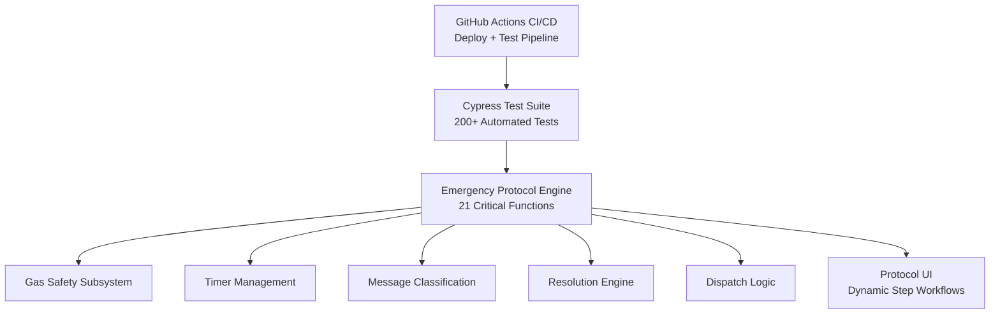

🏗️ SYSTEM ARCHITECTURE
Emergency Response Automation Suite – Technical Design Documentation

This document provides a complete technical overview of the Emergency Response Automation Suite, including the architecture, core subsystems, safety logic, and rationale behind the 21 critical functions that power protocol execution, gas safety, timers, device communication, and resolution workflows.

Table of Contents

System Overview

Architecture Diagram

Core Architecture Components

Protocol Factory

Timer Management System

Gas Safety Subsystem

Message Classification Engine

Resolution Engine

Error Handling Architecture

Security Considerations

Client–Server Boundaries

Integration Points

The 21 Critical Functions

Design Principles

Performance Characteristics

Future Enhancements

1. System Overview

The Emergency Response Automation Suite follows a modular, configuration-driven architecture designed to:

Decouple protocol definition from logic

Eliminate repetitive manual steps in Blackline Live workflows

Preserve specialist control for all safety-critical decisions

Fail safely under every uncertainty

Scale horizontally by loading new protocols via configuration

Improve auditability with deterministic logging

The system accurately simulates Blackline Live alert handling, including:

Protocol step sequencing

Timer-driven escalation

Gas monitoring & normalization detection

Device messaging & response classification

Dispatch decision validation

Safety-gated resolution logic

Full protocol restart cycles

2. Architecture Diagram

The following simplified diagram is the official architecture representation.

3. Core Architecture Components

The architecture consists of three major layers.

3.1 UI Layer

Responsible for all visible user interaction:

Protocol step UI (dynamic 5-step flows)

Gas telemetry panel

Device connectivity panel

Device messaging interface

Timer display

Resolution controls & override workflow

3.2 Automation Engine

Contains the 21 critical functions, grouped into:

Protocol loading & step execution

Timer management

Gas safety & normalization

Message classification

Dispatch evaluation

Resolution enforcement

Audit log generation

3.3 Data & Integration Layer

Maintains:

Current alert data

Protocol configuration objects

User configuration

Full audit log

Future integration points for the BLN Live API

4. Protocol Factory

The Protocol Factory selects, loads, and constructs the full protocol flow.

Purpose

Provide a data-driven definition of workflows

Remove all hardcoded logic

Enable customer-specific variations

Permit new protocols without code deployment

Example Protocol Object
{
  "name": "Gas Emergency Protocol",
  "steps": [
    { "id": "step-1", "action": "call-device" },
    { "id": "step-2", "action": "message-device", "timer": 120 },
    { "id": "step-3", "action": "call-user" },
    { "id": "step-4", "action": "contact-ecs" },
    { "id": "step-5", "action": "dispatch" }
  ]
}

Benefits

Full configurability

Instant support for new alert types

Powers the future Protocol Configuration Manager (PCM)

5. Timer Management System

A single global timer ensures predictable behavior and prevents confusion or overlap.

Core Features

Centralized global state

Accurate 1-second countdown

Audio + visual alerts

Expiration-triggered step routing

Clean cancellation behavior

Prevention of overlapping or “ghost timers”

Timer Metadata Example
{
  "stepId": "step-2",
  "label": "Gas Monitoring",
  "duration": 120,
  "startTime": 1732819200000,
  "timerType": "monitoring",
  "isRunning": true
}

6. Gas Safety Subsystem

Gas safety is a safety-critical subsystem enforcing:

Real-time H₂S, CO, LEL, O₂ rendering

HIGH vs NORMAL classification

O₂ depletion & enrichment detection

2-minute automatic monitoring windows

Normalization detection

Resolution blocking while gas HIGH

Override workflow requiring explicit reasoning

Gas Classification Rules
If O₂ < 19.5% or > 23.5% → DANGEROUS  
If H₂S > 10ppm or CO > 35ppm or LEL > 10% → HIGH  
Else → NORMAL  

Fail-safe default:
Missing or invalid gas data → HIGH

7. Message Classification Engine

A context-aware engine interpreting incoming device messages.

Prompt Sent	Reply	Meaning	Action
Do you need help?	No	User is OK	Resolve
Are you OK?	Yes	User is OK	Resolve
Any	Send help	Emergency	Dispatch
Any	Unknown	Ambiguous	Manual review

The engine uses stateful context, not simple keyword matching.

8. Resolution Engine

Uses deterministic logic:

If gas HIGH → block resolution  
If dispatch occurred → incident-with-dispatch  
Else → incident-without-dispatch  

Additional rules:

Pre-alert detection (≥24 hours old)

Override required for HIGH gas

Automatic log entries with MST timestamps

Full audit chain preserved

9. Error Handling Architecture

A multi-layer safety strategy:

9.1 UI Layer Errors

Disabled buttons prevent unsafe interactions

Warning states for missing data

Clear visual states

9.2 State Machine Guards

Steps cannot run out of order

Steps cannot double-execute

Illegal transitions blocked

9.3 Timer Safety

Only one timer can run

Expiration and cancellation behavior standardized

Automatic cleanup

9.4 Gas Safety Defaults

Missing gas data = HIGH

Normalization requires all gases NORMAL

9.5 Message Classification Errors

Unknown messages → no automation

9.6 Resolution Errors

Blocking premature resolution

Blocking invalid workflow states

Requiring override reasons

10. Security Considerations
Prototype Security

The current implementation is fully client-side:

No external API calls

No stored credentials

No backend dependencies

Sanitized input handling

Clear separation of UI & logic

CSP-friendly structure

Production Security Requirements

Future API integration must support:

OAuth2 / JWT authentication

Signed & encrypted resolution logs

Secure message dispatch

WebSocket/SSE for gas telemetry

Strict server-side validation

Rate limiting & schema validation

11. Client–Server Boundaries
Current Architecture

100% client-side

All data from static fixtures

No network dependencies

Future Architecture

Alerts loaded via API

Gas telemetry from WebSockets

Resolution + dispatch logs POSTed to backend

CI/CD deployment untouched

12. Integration Points

Modeled for future use (fixtures mirror these):

GET /api/alerts/{id}  
POST /api/alerts/{id}/resolve  
POST /api/alerts/{id}/logs  
POST /api/devices/{id}/message  

13. The 21 Critical Functions
13.1 Core Protocol Functions

ProtocolFactory

loadProtocolSteps

loadAlert

startStep

restartProtocolCycle

13.2 Gas Safety Functions

startTwoMinuteMonitoring

updateGasReadings

triggerGasNormalization

isGasCurrentlyNormalized

13.3 Timer Functions

startGlobalTimer

cancelGlobalTimer

handleGlobalTimerCancellation

13.4 Automation Functions

postNote

autoPopulateFromDropdown

addLogEntry

13.5 Intelligence Functions

classifyIncomingMessage

handleMessageClassification

evaluateDispatchConditionsFromConnectivity

13.6 Resolution Functions

resolveAlert

determineResolutionType

13.7 Pre-Alert Functions

21a. isPreAlert
21b. addPreAlertLogEntry
21c. setupPreAlertResolution

14. Design Principles

Configuration over Code

Fail-Safe Defaults

Idempotency

Single Source of Truth

Progressive Disclosure

Conservative Thresholds

Full Auditability

15. Performance Characteristics

Protocol load: <50ms

Step execution: <10ms

Gas rendering: <100ms

Timer interval: 1s

Runtime memory: <1MB

Zero timer leaks with enforced cleanup

16. Future Enhancements

Protocol Configuration Manager (PCM)

Enhanced Alerts Page with visual urgency

Intelligent Alert Assignment System

API-integrated dispatch & resolution

WebSocket telemetry for real-time gas

Persistent server-side audit logs

Document Version: 3.2
Last Updated: November 28, 2025
Author: Ivan Ferrer (Op 417)