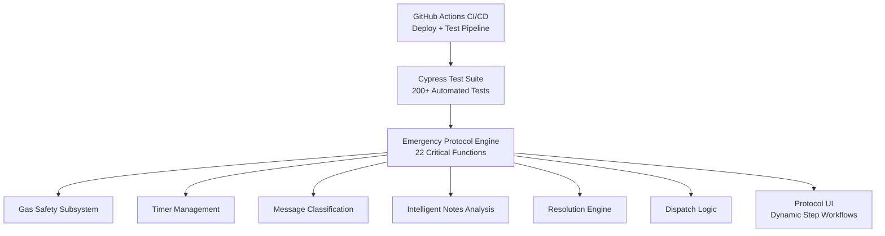

# System Architecture

**Emergency Response Automation Suite - Technical Design Documentation**

*Supporting both gas and non-gas emergency alert protocols*

This document provides a complete technical overview of the Emergency Response Automation Suite, including the architecture, core subsystems, safety logic, and the 22 critical functions that power protocol execution, gas safety, timers, device communication, intelligent coordination, and resolution workflows.

---

## Table of Contents

- [System Overview](#system-overview)
- [Architecture Diagram](#architecture-diagram)
- [Core Architecture Components](#core-architecture-components)
- [Protocol Factory](#protocol-factory)
- [Timer Management System](#timer-management-system)
- [Gas Safety Subsystem](#gas-safety-subsystem)
- [Message Classification Engine](#message-classification-engine)
- [Intelligent Notes Analysis Engine](#intelligent-notes-analysis-engine)
- [Resolution Engine](#resolution-engine)
- [Error Handling Architecture](#error-handling-architecture)
- [Security Considerations](#security-considerations)
- [Client-Server Boundaries](#client-server-boundaries)
- [Integration Points](#integration-points)
- [The 22 Critical Functions](#the-22-critical-functions)
- [Design Principles](#design-principles)
- [Performance Characteristics](#performance-characteristics)
- [Future Enhancements](#future-enhancements)

---

## System Overview

The Emergency Response Automation Suite uses a **modular, configuration-driven architecture** designed to:

- **Decouple protocol definition from execution**
- **Eliminate repetitive manual tasks** in Blackline Live workflows
- **Preserve specialist control** for all safety-critical decisions
- **Fail safely** under uncertainty
- **Scale horizontally** using configuration-only protocols
- **Improve auditability** through deterministic logs and timestamps

### Simulation Scope

The system simulates the full Blackline Live alert lifecycle, including:

- Protocol step sequencing
- Timer-driven escalation
- Gas monitoring and normalization detection
- Device messaging and response classification
- Intelligent specialist coordination through automated pattern recognition that identifies when specialists need to communicate cross-team information, automatically generating appropriate notifications and eliminating manual Teams messaging overhead
- Dispatch decision validation
- Safety-gated resolution logic
- Full protocol restart cycles

---

## Architecture Diagram

*Note: Diagram encompasses both gas and non-gas alert protocol flows*



---

## Core Architecture Components

The system consists of three major layers, each with clear responsibilities.

### UI Layer

Handles all direct user interaction:

- Dynamic 5-step protocol workflows
- Gas telemetry panel (H₂S, CO, LEL, O₂)
- Device connectivity and location panel
- Device messaging interface
- Timer display with countdown
- Intelligent notes analysis interface
- Resolution controls and override workflow

## Why Google Maps Is Not Included in the Prototype

The UI displays device location metadata, but the prototype intentionally does not integrate Google Maps.
This decision is based on a practical constraint:

The prototype does not have access to Blackline’s enterprise Google Maps API keys.
Google Maps for Blackline Live is tied to the company’s enterprise Google account, which is owned and managed by the Development/IT team.
Because the prototype is fully client-side and isolated from Blackline infrastructure, it cannot securely access or store these credentials.
Embedding an API key directly in client-side code is insecure and violates Google usage policies.

Integration is straightforward in production once Dev/IT provides the API key.
When the system moves to production, Google Maps can be enabled quickly by:

- injecting the enterprise API key through backend configuration
- routing all map requests through a secure backend proxy
- enabling the already-prepared location panel in the UI

No architectural changes are required, and all existing alert data is compatible with Google Maps.

### Automation Engine

Implements the 22 critical functions:

- Protocol loading and execution
- Timer management and expiration routing
- Gas safety validation and normalization detection
- Context-aware message classification for both outgoing device messages and incoming device responses, enabling automated interpretation of user confirmations and safety status updates
- Intelligent notes pattern recognition
- Cross-specialist coordination automation that monitors protocol states across multiple alerts and automatically triggers inter-team notifications when coordination is required, such as alerting specialists when emergency contacts respond across different alert sessions or when dispatch decisions affect multiple ongoing protocols
- Dispatch evaluation
- Resolution enforcement
- Deterministic audit log generation

### Data & Integration Layer

**Current State:**

- Alert metadata (client-side fixtures)
- Protocol configuration objects
- User configuration
- Audit log entries

**Phase 1 Implementation Note:** No new API endpoints, backend development, or infrastructure changes are required for Phase 1 deployment. The system operates entirely client-side with configuration-driven protocols.

**Future Integration:**

- BLN Live API
- WebSocket telemetry streams
- Backend resolution persistence

---

## Protocol Factory

The Protocol Factory dynamically loads and constructs protocol flows based on alert type.

### Purpose

- Provide configuration-driven workflow definitions
- Remove all hardcoded step sequences
- Enable customer-specific variations
- Allow new protocols without touching engine code

### Example Protocol Object

```javascript
{
  "name": "Gas Emergency Protocol",
  "steps": [
    { "id": "step-1", "action": "call-device" },
    { "id": "step-2", "action": "message-device", "timer": 120 },
    { "id": "step-3", "action": "call-user" },
    { "id": "step-4", "action": "contact-ecs" },
    { "id": "step-5", "action": "dispatch" }
  ]
}
```

### Benefits

- Full configurability without code changes
- Immediate support for new alert types
- Enables advanced configuration tooling (Protocol Configuration Manager)
- Customer-specific protocol deployments

---

## Timer Management System

A single global timer ensures predictable, safe, and conflict-free time-driven behavior.

### Core Features

- Centralized timer state (prevents conflicts)
- 1-second countdown updates
- Visual + audio expiration alerts
- Clean cancellation logic
- Prevention of overlapping timers

### Timer Metadata Example

```javascript
{
  "timerId": "global-step-2",
  "type": "message-device-wait",
  "duration": 120,
  "remaining": 95,
  "stepId": "step-2"
}
```

### Safety Logic

- Automatic cancellation on protocol completion
- Memory leak prevention through cleanup handlers
- Context preservation during timer switches

---

## Gas Safety Subsystem

Implements gas-specific safety logic and monitoring requirements.

### 2-Minute Monitoring Window

For specific gas protocols with monitoring enabled, the system automatically:

1. Starts 120-second countdown on Step 1 execution
2. Monitors gas readings continuously
3. Triggers auto-resolution if readings normalize
4. Prevents manual resolution while gas levels remain HIGH
5. Provides override capability with audit logging

### Gas Normalization Detection

```javascript
function isGasCurrentlyNormalized(gasData) {
  return gasData.H2S === "NORMAL" && 
         gasData.CO === "NORMAL" && 
         gasData.LEL === "NORMAL" && 
         gasData.O2 === "NORMAL";
}
```

### Resolution Gate Logic

- **HIGH gas + no override:** Resolution blocked
- **NORMAL gas:** Resolution permitted
- **Override enabled:** Resolution permitted with audit trail

---

## Message Classification Engine

Provides intelligent interpretation of device communications and user responses.

### Classification Categories

- **Confirmed Safe:** "I'm okay", "All good", "Safe"
- **Needs Help:** "Help", "Emergency", "Not okay"
- **Ambiguous:** Unclear responses requiring specialist review
- **No Response:** Timeout handling

### Response Patterns

```javascript
const messagePatterns = {
  safe: ["ok", "good", "fine", "safe", "alright"],
  help: ["help", "emergency", "not okay", "trouble"],
  location: ["here", "location", "where", "GPS"]
};
```

### Integration Points

- Real-time message processing
- Automated response suggestions
- Context-aware classification based on protocol state

---

## Intelligent Notes Analysis Engine

Analyzes specialist notes in real-time to identify actionable patterns and coordination opportunities.

### Pattern Recognition

- **Safety Status:** Confirmation phrases, concern indicators
- **Dispatch Requirements:** Service needs, urgency levels

### Coordination Benefits

Eliminates cross-specialist coordination delays by:

- Detecting patterns in specialist notes
- Canceling active timers
- Populating resolution intent
- Notifying the specialists handling that particular alert
- Ensuring actions are synchronized

### Confidence Scoring

Actions triggered only when pattern confidence exceeds 95% threshold to ensure safety and accuracy.

---

## Resolution Engine

Handles safe, auditable alert closure with multi-factor validation.

### Resolution Types

- **incident-with-dispatch:** For gas alerts or true incidents, where Emergency services dispatch
- **incident-without-dispatch:** For gas alerts or true incidents alerts resolved without Emergency services dispatch  
- **false-alert-with-dispatch:** For non-gas alerts resolved with Emergency services dispatch
- **false-alert-without-dispatch:** For non-gas alerts resolved without Emergency services dispatch
- **pre-alert:** Alert >24 hours old (stale)

### Resolution Logic

```javascript
function determineResolutionType(alertData, protocolState) {
  // Gas safety gate
  if (gasData.isHigh && !override) {
    return "BLOCKED"; // Resolution prevented
  }
  
  // Determine type based on protocol outcome
  if (protocolState.dispatchOccurred) {
    return alertData.isFalseAlert ? 
           "false-alert-with-dispatch" : 
           "incident-with-dispatch";
  } else {
    return alertData.isFalseAlert ? 
           "false-alert-without-dispatch" : 
           "incident-without-dispatch";
  }
}
```

### Safety Gates

- **Gas Level Check:** Prevents resolution with HIGH readings unless override provided
- **Override Authorization:** Tracks manual safety overrides with required justification
- **Audit Trail:** Complete logging of resolution rationale and timestamp

### Pre-Alert Logic

For alerts older than 24 hours:

- Display warning banner
- Disable all protocol steps
- Enable only "Resolve Alert" with auto-filled resolution
- Log pre-alert handling in audit trail

---

## Error Handling Architecture

### Error Categories

- **Configuration Errors:** Invalid protocol definitions
- **Runtime Errors:** Execution failures, timeouts
- **Data Errors:** Missing or corrupted alert metadata
- **Integration Errors:** Communication failures with external systems

### Recovery Strategies

```javascript
const errorHandlers = {
  protocolLoadFailure: () => fallbackToManualMode(),
  timerFailure: () => displayManualTimerPrompt(),
  gasDataFailure: () => requireManualSafetyCheck(),
  dispatchFailure: () => enableManualDispatchOverride()
};
```

### Failsafe Behavior

System defaults to manual specialist control when automated functions fail, ensuring no safety compromise.

---

## Security Considerations

### Data Protection

- No sensitive PII stored client-side
- Alert metadata anonymized in fixtures
- Audit logs exclude personal information

### Session Management

- Operator authentication via existing BLN Live system
- Session tokens validated on critical actions

### Audit Trail Integrity

- Immutable log entries with timestamps
- Operator ID tracking for all actions
- Tamper-evident logging format

---

## Client-Server Boundaries

### Current Implementation

**Client-Side Only:**
- Protocol execution engine
- UI state management
- Timer coordination
- Gas safety logic
- Pattern recognition
- Audit log generation

**External Dependencies:**
- Alert metadata (fixtures)
- Protocol configurations
- Gas telemetry simulation

### Future Server Integration

**Planned Server-Side:**
- Real-time alert ingestion
- Persistent audit logging
- Cross-session state management
- WebSocket gas telemetry

---

## Integration Points

### Current Integrations

- **GitHub Pages:** Static hosting and CI/CD
- **Cypress:** Automated testing pipeline
- **Local Storage:** Session and configuration persistence

### Planned Integrations

- **BLN Live API:** Real alert data ingestion

### API Design Examples

**Alert Ingestion:**
```
POST /api/alerts
Body: { alertType, deviceId, location, gasReadings, timestamp }
```

**Device Messaging:**
```
POST /api/devices/{id}/message
Body: { deviceId, message, timeout }
```

---

## The 22 Critical Functions

### Core Protocol Functions

1. **ProtocolFactory** - Configuration-driven protocol engine
2. **loadProtocolSteps** - Dynamic UI generation from configs
3. **loadAlert** - Alert initialization and protocol loading
4. **startStep** - Protocol step execution with idempotency
5. **restartProtocolCycle** - Protocol retry logic

### Gas Safety Functions

6. **startTwoMinuteMonitoring** - Automated gas monitoring window
7. **updateGasReadings** - Real-time gas panel updates
8. **triggerGasNormalization** - Auto-resolution on normalization
9. **isGasCurrentlyNormalized** - Safety validation gate

### Timer Functions

10. **startGlobalTimer** - Centralized countdown timer
11. **cancelGlobalTimer** - Timer cleanup
12. **handleGlobalTimerCancellation** - Context-aware cancellation

### Automation Functions

13. **postNote** - Automated note generation
14. **autoPopulateFromDropdown** - Auto-fill from selections
15. **addLogEntry** - Audit trail logging

### Intelligence Functions

16. **classifyIncomingMessage** - Context-aware message interpretation
17. **handleMessageClassification** - Execute response based on classification
18. **analyzeNote** - Real-time pattern recognition in specialist notes
19. **evaluateDispatchConditionsFromConnectivity** - Automated dispatch logic

### Resolution Functions

20. **resolveAlert** - Safety-gated alert closure
21. **determineResolutionType** - Deterministic classification

### Pre-Alert Functions

22-23. **isPreAlert**, **addPreAlertLogEntry**, **setupPreAlertResolution** - Stale alert handling

---

## Design Principles

### 1. Configuration Over Code

Protocols are data structures, not hardcoded logic

### 2. Fail-Safe Defaults

When uncertain, require specialist intervention

### 3. Idempotency

Actions can be retried safely without side effects

### 4. Single Source of Truth

One authoritative data source per concept

### 5. Progressive UI Disclosure

Show elements only when relevant

### 6. Conservative Safety Thresholds

Use NORMAL (not LOW) for safety margin

### 7. Full Auditability

Every action logged with timestamp and operator ID

### 8. Intelligent Coordination

Eliminate manual communication overhead through pattern recognition

---

## Performance Characteristics

### Client-Side Performance

*Note: Performance metrics based on local development environment testing and optimization targets*

- **Protocol loading:** <50ms (config lookup + UI render)
- **Step execution:** <10ms (event handler + state update)
- **Gas panel updates:** <100ms (real-time display)
- **Timer updates:** 1 second interval (visual countdown)
- **Pattern recognition:** <100ms (note analysis + confidence calculation)
- **Cross-specialist coordination:** <200ms (action execution + notification)
- **Runtime memory:** <2MB (alert data + protocol state + pattern engine)

### Quality Metrics

- **Zero timer leaks:** Guaranteed cleanup on resolution
- **Zero memory leaks:** Proper interval clearing
- **Deterministic behavior:** Same inputs = same outputs
- **100% test coverage:** All 22 functions validated
- **Pattern accuracy:** >95% confidence threshold for automatic actions

---

## Future Enhancements

### Strategic Features

1. **Protocol Configuration Manager (PCM)**

*Reference: Protocol Configuration Manager technical document*

The PCM is an internal tool for Blackline Safety designed to create, validate, and deploy customer-specific emergency response protocols efficiently. Key capabilities include:

- JSON-based protocol design and validation
- Customer profile management with device capabilities
- Emergency contact hierarchy configuration
- Protocol template library for common scenarios
- Version control and rollback capabilities
- Integration with existing Emergency Response Automation Suite

The PCM addresses protocol customization complexity by enabling SOC support staff to configure customer-specific emergency response procedures without requiring custom development for each variation.

2. **Visual Identification of Acknowledgment Status**

*Reference: Real-time visual alert status technical document*

This feature modernizes the Alerts Portal by introducing a real-time, color-coded urgency system that instantly communicates how long each alert has remained unacknowledged. Every active alert displays a continuously running timer and automatically shifts through three visual states:

- **Blue (0-30 seconds):** Standard attention required
- **Yellow (31-50 seconds):** Approaching SLA threshold  
- **Red (51+ seconds):** SLA breach with "+MM:SS" overdue indicator

When acknowledged, alerts turn green with operator ID tooltip, and resolved alerts appear in neutral style with resolution reason. These enhancements eliminate reliance on manual Teams messages, reduce risk of missed acknowledgments, and significantly improve operator efficiency by making alert urgency visually obvious across the entire SOC.

3. **Intelligent Alert Assignment System**

*Reference: Alert Auto-Assignment System for Blackline Live technical document*

This system eliminates the current "first-click race" problem where specialists compete for incoming alerts, creating ownership gaps between acknowledgment and action. Key features include:

- Automated workload balancing based on active alert counts
- Language-aware assignment routing (Spanish/French alerts to capable specialists)
- Hybrid mode with manual fallback capabilities
- Real-time shift lead dashboard for monitoring and overrides
- 90% reduction in alert-to-ownership time (25-40 seconds → <2 seconds)
- Complete audit trail with fairness metrics and performance tracking

The system builds on existing BLN Live infrastructure with minimal UI modifications and provides comprehensive fallback mechanisms to ensure operational safety.

### Technical Enhancements

- WebSocket real-time gas telemetry
- Server-side persistent audit logging
- Advanced analytics dashboard integration with existing Blackline Analytics platform (https://support.blacklinesafety.com/products/blackline-analytics) to provide enhanced operational insights, performance metrics, and compliance reporting within the established Blackline ecosystem

---

## Related Documentation

- **[README.md](../README.md)** - Project overview
- **[ROADMAP.md](./ROADMAP.md)** - Future features and timeline
- **[DEPLOYMENT_APPROACH.md](./DEPLOYMENT_APPROACH.md)** - Production deployment strategy
- **[TESTING.md](./TESTING.md)** - Test coverage and quality assurance
- **[WORKFLOW_AUTOMATION.md](./WORKFLOW_AUTOMATION.md)** - Manual vs automated workflows

---

**Document Version:** 3.4
**Last Updated:** November 29, 2025
**Author:** Ivan Ferrer - Alerts Specialist ("Future" SOC Technical Innovation Lead)